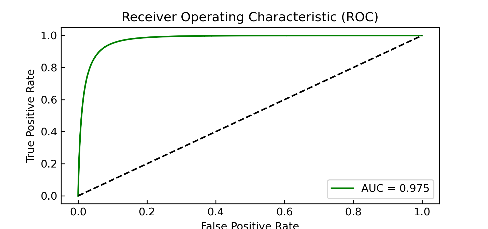
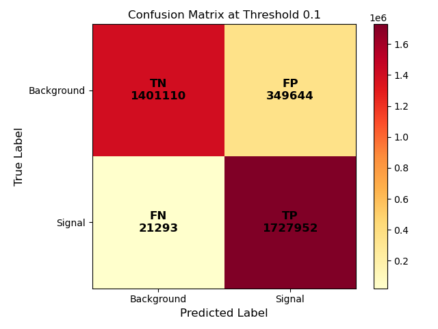
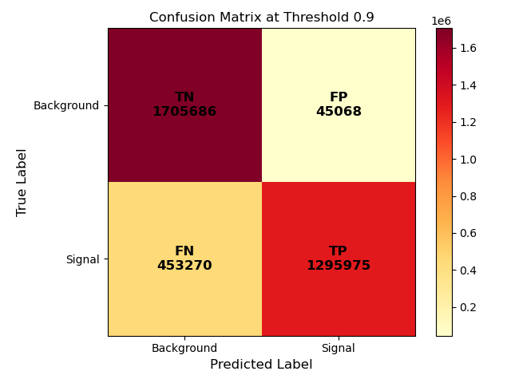
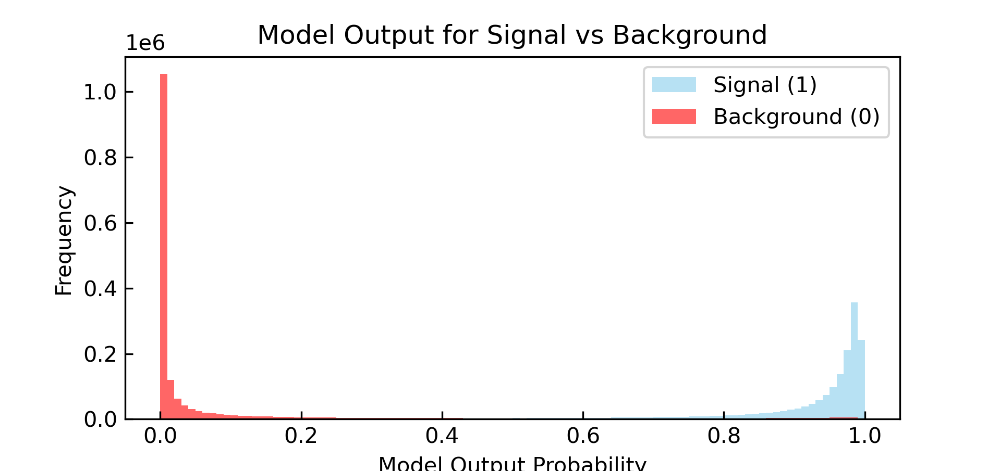

# Classification Model For HEP Mass Signal Event Classification
Hello! This repository contains a classification model I created using PyTorch for the classification of signal events from collider physics data. Model was based on data provided by UC Irvine Machine Learning Repository, https://archive.ics.uci.edu/dataset/347/hepmass. In my repository you will find my test.py, which locates the classification model, and analysis.py, which locates various analysis and plotting I did to look at the model's performance.
## Table of Contents
- [Overview](#Overview)
- [Model Breakdown](#modelbreakdown)
- [Analysis](#analysis)
- [Improvements and Next Steps](#improvementsandnextsteps)
## Overview
The purpose of the model developed in this paper is to take data from the UCI dataset and successfully distinguish between signal and background events given the 27 input features. Since the purpose is to distinguish between 1 (signal event) behavior and 0 (background event), the model was developed as a supervised learning algorithm classification model. The model was developed using PyTorch and corresponding Python tools.
## Model Breakdown
  To start, to classify an event, I made an artificial neural network (ANN). The first layer or input layer started with the 27 input features from the dataset, which were then mapped to 128 neurons in the ANN. The neurons are each composed of a weighted sum of all 27 input parameters with equal weights and biases. Next, there are two hidden layers that take the 128 neurons from the input layer and compress to 64 in the first hidden layer then 32 in the next. The final layer or output layer takes the 32 neurons into 1 output, which is a probability from 0 to 1. Later in the analysis, a threshold study is done to see what acceptance is correct for signal vs background probability. In between each layer of the ANN is a rectified linear unit (ReLU) activation function to add complexity to the model.

  The next part of the process was to train the model using the training set. The loss function used was a binary cross entropy (BCE) loss. The reason for choosing this is my model output is a probability between 1 and 0, and when training the model BCE loss highlights large distinctions between prediction and data. 

  To optimize, I used the Adam Optimizer in PyTorch. To ensure the model was trained I ran 10 epochs. Originally, I projected to run 20, but the accuracy of the model began to plateau after 5. Once training was completed, I evaluated the model with the test set. 
## Analysis
  To evaluate the model’s effectiveness, I looked at its precision, accuracy, recall and F1 values. Since the model outputs a probability between 0 and 1, it is important in the analysis to choose an appropriate threshold value to distinguish between signal and background. To start, 0.5 was picked as the threshold, with above 0.5 from the model output being labeled a signal event, and below a background event. Later an analysis on varying thresholds is done. 

  The model at threshold 0.5 was able to attain successful results in terms of the evaluation metrics described above. At threshold 0.5, the precision was 0.916, accuracy was 0.926, recall was 0.939 and F1 was 0.927. Model was successful in predicting signal events and separating signal and background.

  Another metric to evaluate a model is to plot a receiver operator characteristic (ROC) curve. This is a plot of the false positive rate on the horizontal axis and the true positive rate on the vertical axis. The purpose of an ROC curve is to evaluate a classification model at different thresholds. The area under the curve (AUC) is an important metric in this evaluation, with an AUC of 1 being the most optimized classifier. My model’s curve shows an AUC of 0.975, indicating that it does very well to distinguish signal and background events. 
  

  For the sake of variance, what would the analysis look like at different thresholds? To show this, confusion matrices to highlight the importance of an optimized threshold. If you pick a too high of a threshold, the false negative rate spikes and if you pick too low of a threshold, the false positive rate spikes. For this analysis, 0.5 is a good place as it offers a balance, but to find the optimized threshold, further adjustments need to be made to the model. 
 
  
  
  
  
## Improvements and Next Steps
While the model did well given the metrics, we have to evaluate its predictions, there are further steps to take after this project. First would be to design a more complex model. What do I mean? Well, my neural network only had 4 layers, so adding more would potentially help the model. Also, potentially pivoting the model to a decision tree or support vector machine (SVM) model may help distinguish events better than the one I used. Besides adjusting the type of classification model, it would be interesting to see how an unsupervised model would perform with this dataset. Since this dataset has unidentified, normalized parameters, it would be a good idea to pursue this in the future. Another method of improvement would be to find the optimized threshold for this iteration of the model. 
